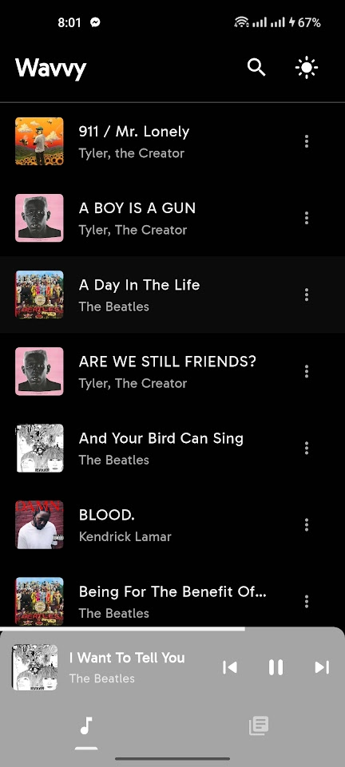
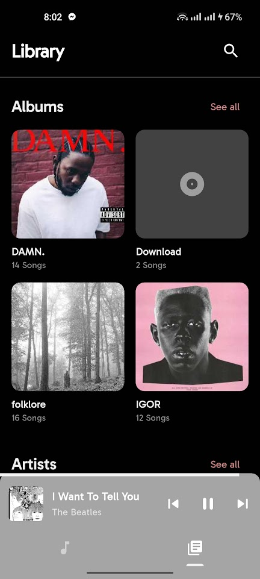
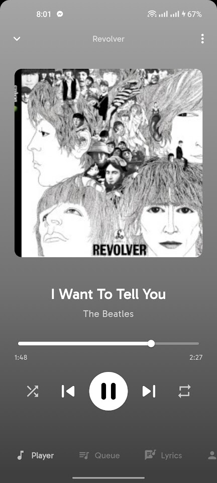
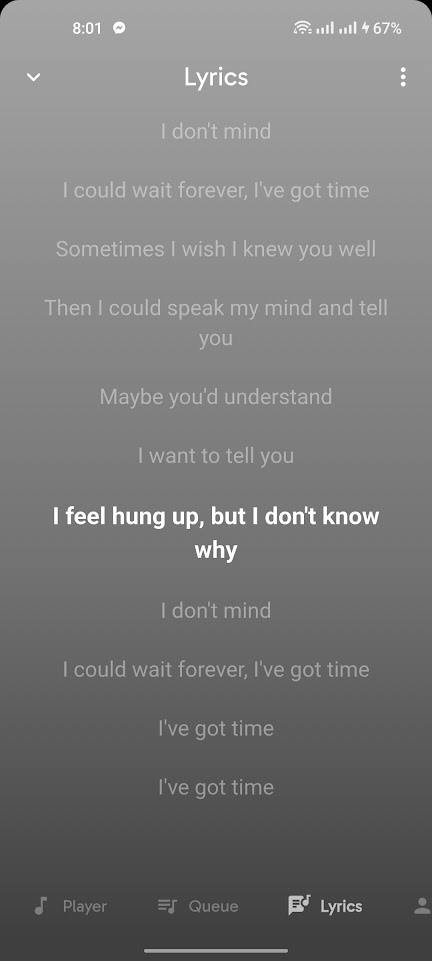
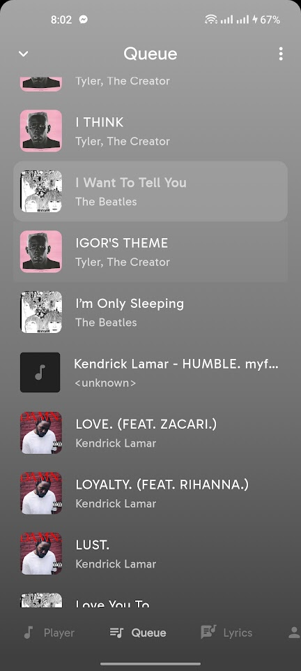
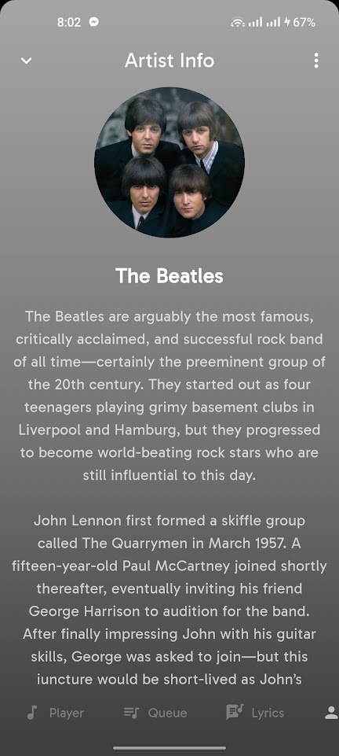

# Wavvy

A lightweight music player for Android, built with Flutter.

|  |  |  |
| ------------------------------------------------- | ---------------------------------------------------- | -------------------------------------------------- |
| Home                                              | Library                                              | Player Sheet                                       |

|  |  |  |
| --------------------------------------------------- | -------------------------------------------------- | --------------------------------------------------- |
| Lyrics                                              | Queue                                              | Artist Info                                         |

### Features

- Gapless Playback: Powered by `just_audio` for high-fidelity, seamless audio.

- Adaptive UI: The player interface automatically adapts its color scheme to match the album art of the current track.

- Live Lyrics: Automatically fetches and syncs time-stamped lyrics from LRCLib.

- Artist Insights: Integrates with the Genius API to fetch artist biographies and photos.

- System Integration:

  - Background Playback: Continues playing when the app is closed.

  - Notification Controls: Full media controls with album art in the notification shade.

  - Lock Screen: Native lock screen media support.

### Permissions

Wavvy requires storage access to find your music.

- Android 13+: Requests READ_MEDIA_AUDIO and READ_MEDIA_IMAGES.
- Android 12 & below: Requests READ_EXTERNAL_STORAGE.

Note: The app will prompt for permissions on the first launch. If denied, the library will be empty
